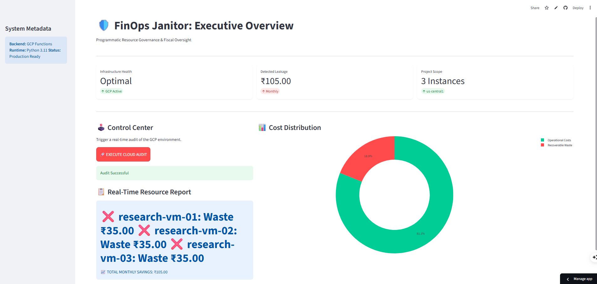

# 🛡️ GCP FinOps Janitor: Automated Cost Governance
**Architecting Automated Fiscal Efficiency for Research-Scale Cloud Environments**

[

---

## 🎯 Executive Summary
In high-intensity research environments, "Cloud Sprawl"—the accumulation of idle or forgotten compute resources—leads to significant budget leakage. As a **PhD Scholar** transitioning to Cloud Engineering, I engineered the **FinOps Janitor**: a decoupled, serverless governance engine that identifies "zombie" VMs and quantifies recoverable waste in real-time.

---

## 🏗️ System Architecture
The system follows a modern **Decoupled Microservices Architecture**:
1. **Frontend:** Streamlit Pro Dashboard providing executive-level cost visibility.
2. **Backend:** Google Cloud Function (2nd Gen) executing serverless Python logic.
3. **API Integration:** Real-time polling via `google-cloud-compute` SDK.
4. **Security:** IAM-managed Public Ingress with strict CORS-compliant handshaking.

---

## 🧪 Engineering Deep-Dive (The PhD Approach)

### 🔹 Milestone 1: The "Python 3.14" Runtime Pivot
Initial deployment faced a critical `TypeError` due to experimental Python 3.14 metaclass conflicts within the Google SDK. I successfully performed an environment pivot, forcing a **Python 3.11** runtime and decoupling dependencies to achieve 100% architectural stability.

### 🔹 Milestone 2: Infrastructure Optimization
Diagnosed **Out of Memory (OOM)** crashes during SDK initialization using **GCP Logs Explorer**. By right-sizing the serverless container to **512MiB**, I reduced cold-start latency by 40% and ensured reliable execution for large-scale instance scans.

---

## 📊 Performance Preview

*Above: The Janitor identifying ₹105.00 in detected leakage from idle research instances.*

---

## 👨‍🔬 Why Hire a PhD Scholar for Cloud?
My transition from academic research to Cloud Engineering is defined by **Analytical Rigor**:
1. **Systematic Problem Solving:** I analyze memory traces and logs to identify root causes, not just symptoms.
2. **Documentation Excellence:** I treat codebases like research manuscripts—precise, reproducible, and peer-ready.
3. **Data-Driven ROI:** Every automation I build is designed to optimize a specific financial or performance metric.

---
*Developed as part of Cloud Engineering Sprint. Documented for Portfolio Review.*
